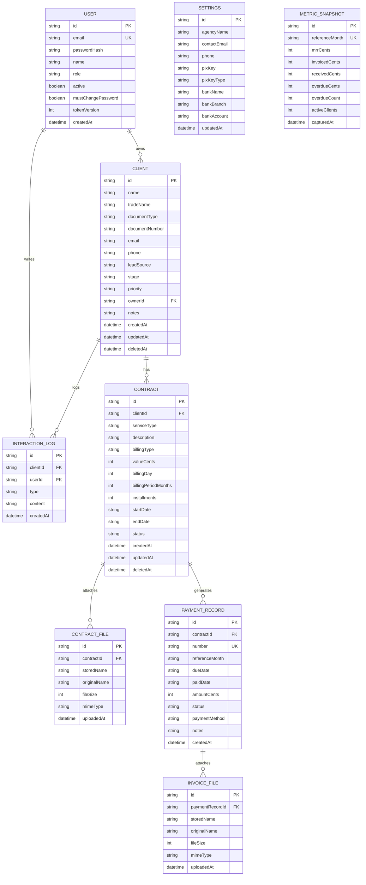

# Plano Consolidado — CRM para Agência de Marketing

Documento único de referência do projeto. Consolida a proposta inicial com as decisões
tomadas na revisão: autenticação por JWT, faturamento com registro manual de pagamento
(sem geração de boleto e sem integração bancária) e fatiamento vertical da entrega.

> Este documento **decide**. Onde havia duas bibliotecas ou dois caminhos possíveis,
> um foi escolhido e a razão está registrada. Alternativas descartadas ficam na
> seção 13 para não serem rediscutidas.

---

## 1. Visão geral

CRM interno para uma agência de marketing gerenciar leads, clientes, contratos
(recorrentes e pontuais) e o registro de pagamentos mês a mês, com anexo de contratos
assinados e notas fiscais, alertas de vencimento e disparo rápido de mensagens no
WhatsApp.

O sistema **registra** o que já aconteceu no mundo real. Ele não emite boleto, não
emite nota fiscal, não fala com banco e não movimenta dinheiro.

### Pilares

1. Gestão de leads e clientes (PF/PJ) com origem, contato e histórico.
2. Pipeline de vendas em Kanban com arrastar e soltar, mais visão em tabela com filtros.
3. Contratos com anexo do documento assinado.
4. Cobranças mensais com marcação manual de pagamento e anexo de NF.
5. Dashboard com MRR, inadimplência e alertas de vencimento.
6. Comunicação rápida via WhatsApp com mensagens pré-preenchidas.
7. Acesso por login, com módulo administrativo restrito a quem tem permissão.
8. Execução simples: `docker compose up` sobe aplicação e banco juntos.

---

## 2. Escopo

### 2.1. Dentro do escopo

- Autenticação por JWT com sessão em cookie `httpOnly`.
- CRUD de clientes/leads, contratos, cobranças e anexos.
- Geração das linhas de cobrança de contratos recorrentes (ver RF-20 a RF-26).
- Marcação manual de pagamento, com data, forma e valor editáveis.
- Upload/download de contrato assinado (PDF/DOCX) e de NF (PDF/XML).
- Dashboard com métricas financeiras e alertas.
- Links `wa.me` com mensagem pré-preenchida.
- Exportação de clientes e cobranças em CSV.

### 2.2. Fora do escopo (explícito)

Estes itens **não** serão construídos. Estão listados porque o nome dos módulos
sugere o contrário e a expectativa precisa ficar alinhada por escrito.

- **Emissão de nota fiscal.** O sistema anexa o arquivo da NF emitida em outro lugar.
  Não há integração com SEFAZ, prefeitura ou emissor.
- **Geração de boleto** e qualquer forma de cobrança automática.
- **Integração bancária** e conciliação automática de pagamentos. A baixa é manual.
- **API oficial do WhatsApp Business.** O envio usa link `wa.me`, que abre o app com
  o texto pronto — o usuário confere e aperta enviar. Links `wa.me` **não anexam
  arquivos**: a NF continua sendo anexada à mão na conversa.
- **Controle de acesso granular.** Existem dois papéis fixos (RF-07). Permissão por
  campo, por cliente, por tela ou papéis customizáveis não estão no escopo.
- **Aplicativo mobile nativo, e uso em celular de forma geral.** O sistema é
  desktop-only por decisão (P4).
- **Módulo de tarefas.** Os mockups trazem um botão "Create Task" no cabeçalho de todas
  as telas e uma aba global "Timeline" — decidido que saem. Não há tarefas, prazos nem
  atribuição de trabalho no sistema.
- **Central de notificações, chat interno e busca global.** Os três ícones no cabeçalho
  dos mockups saem junto. Busca existe dentro de cada listagem, não no topo.
- **Tela de status de infraestrutura ou deploy dentro do app.** Ver 13.2.
- **Upload de logo da agência** e ações em massa na listagem de clientes (a seleção
  múltipla com checkbox dos mockups sai).
- **Multi-tenant.** Uma instalação atende uma agência.

---

## 3. Pressupostos e restrições

Estes pressupostos moldam decisões de arquitetura. Se algum estiver errado, avise —
alguns mudam escolhas estruturais.

| # | Pressuposto | O que muda se estiver errado |
|---|---|---|
| P1 | Duas pessoas hoje, com crescimento previsto para uma equipe | Já absorvido: papéis `admin`/`membro` existem desde a fatia 1 (RF-07) |
| P2 | Centenas de clientes, não dezenas de milhares | Volume maior exigiria paginação server-side e revisão de índices |
| P3 | Local agora; VPS com domínio próprio depois | Já absorvido: HTTPS obrigatório em produção e cookie `Secure` por ambiente (8.2) |
| P4 | **Uso exclusivo em desktop**, largura mínima de 1280px | Nenhum — decisão tomada, sem fallback mobile no Kanban |
| P5 | Operação no fuso de Brasília (UTC−3) | Datas civis precisariam de timezone por usuário |

**Restrições:**

- Toda a aplicação sobe com um `docker compose up`, banco incluso.
- Sem serviços pagos ou chaves de API de terceiros.
- Uma linguagem de aplicação (TypeScript) no backend e no frontend.

---

## 4. Stack — decisões fechadas

### Frontend

- **React 18 + TypeScript + Vite**
- **Tailwind CSS** + **Lucide Icons**
- **Radix UI** para primitivos acessíveis (modal, tabs, dropdown, tooltip).
  *Headless UI foi descartado — são bibliotecas concorrentes; usar as duas significa
  dois sistemas de foco e dois padrões de acessibilidade.*
- **@hello-pangea/dnd** para o Kanban. *Fork mantido do react-beautiful-dnd; entrega o
  comportamento clássico de quadro com menos código que dnd-kit e tem suporte a toque.
  dnd-kit seria a escolha se precisássemos arrastar em grade ou canvas.*
- **Recharts** para gráficos. *API composable em React, integra na árvore de
  componentes. Chart.js exigiria wrapper imperativo e ref para cada gráfico.*
- **Sonner** para toasts.
- **TanStack Query** para cache e revalidação das chamadas de API.

### Backend

- **Node.js + Express (TypeScript).** *Escolhido sobre C#/ASP.NET Core para manter uma
  linguagem só no projeto: os tipos de `Client`, `Contract` e `PaymentRecord` são
  escritos uma vez e usados nos dois lados, sem passo de geração via OpenAPI. Imagem e
  consumo de RAM menores também pesam numa VPS pequena. ASP.NET Identity e EF Core
  seriam vantagens reais, mas o que elas entregam aqui é pouco código.*
- **PostgreSQL 16** com **Prisma ORM**. *Escolhido sobre SQLite porque a equipe vai
  crescer (P1) e o sistema vai para VPS (P3) — o argumento do SQLite era "arquivo
  único, sem servidor", e em VPS já existe Docker Compose, onde o Postgres é mais um
  serviço. Migrar depois, com dados reais e anexos vinculados, custa muito mais.*
- **Multer** para upload
- **bcryptjs** para hash de senha. *Versão pura-JS escolhida sobre o `bcrypt` nativo
  porque o nativo exige `node-gyp` e build tools na imagem Alpine. O custo de
  performance é irrelevante para um login por dia.*
- **jsonwebtoken** e **cookie-parser**
- **express-rate-limit** no login
- **Zod** para validação de payload nas bordas

### Infraestrutura

- `Dockerfile` multi-stage: build do React, build do server, imagem final só com runtime.
- **O Express serve o build do React na mesma origem.** Sem CORS, e o cookie de sessão
  funciona sem `SameSite=None`.
- `docker-compose.yml` com três serviços: `app`, `db` (Postgres) e `proxy` (Caddy, só
  em produção). **Volumes nomeados** para os dados do Postgres e para os uploads.
- O `db` tem `healthcheck` e o `app` declara `depends_on: condition: service_healthy` —
  sem isso o app sobe antes do banco aceitar conexão e morre no primeiro boot.
- **O Postgres não publica porta para o host em produção.** O `app` o alcança pela rede
  interna do Compose. Em desenvolvimento a porta 5432 pode ser exposta para inspeção
  com cliente de banco.

### 4.1. Design system e mockups

O design está em [`docs/design/DESIGN.md`](design/DESIGN.md) — tema "Kinetic Enterprise",
com paleta, tipografia, espaçamento, elevação e especificação de componentes. É a fonte
de verdade visual e vira os tokens do `tailwind.config.js`.

Resumo do que importa na implementação:

- **Cores:** navy profundo (`#0F172A`) como âncora, teal (`#0D9488`) como cor de ação.
  Chips de status usam tinta de baixa saturação com texto escuro do mesmo tom.
- **Tipografia:** Inter em todo o sistema, com `font-variant-numeric: tabular-nums` nas
  tabelas e nos tiles do dashboard — é o que faz colunas de valores alinharem.
- **Layout:** sidebar fixa em 260px, grid fluido de 12 colunas, container máximo de
  1440px, ritmo de 8px.
- **Elevação:** camadas tonais e contornos de 1px em vez de sombra pesada. Card do
  Kanban sobe para o nível 2 enquanto é arrastado.
- **Formas:** 4px em botões e inputs, 8px em cards, pill nos chips de status.

Os mockups gerados estão em [`docs/design/mockups/`](design/mockups/), com um
[README](design/mockups/README.md) marcando quais são canônicos e quais foram rejeitados
ou precisam de correção. **Os mockups ilustram, o plano decide** — onde os dois
divergirem, vale este documento.

---

## 5. Modelo de dados



### 5.1. Decisões de modelagem

**Dinheiro em `Int`, com sufixo `Cents` no nome do campo.** `Float` acumula erro de
ponto flutuante em somatórios — o MRR e a inadimplência apresentariam centavos fantasma
visíveis ao usuário. Com Postgres, `@db.Decimal(12,2)` passa a ser uma opção real (não
era em SQLite), mas foi descartada: o JavaScript não tem decimal nativo, então o Prisma
devolve instâncias de `Decimal.js` que viram string no JSON e exigem cuidado em cada
camada. Centavos inteiros mantêm a aritmética em `number` puro do começo ao fim. O
sufixo no nome do campo existe para que ninguém formate o valor errado por engano.

**Datas civis como `String` no formato `YYYY-MM-DD`.** Vale para `startDate`,
`endDate`, `dueDate` e `paidDate`. Um vencimento "dia 10" é uma data no calendário,
não um instante no tempo. Armazenar como `DateTime` faz o Prisma gravar em UTC, e à
meia-noite de Brasília o dia 10 já é dia 11 em UTC — os alertas de "próximos 7 dias" e
de atraso errariam por um dia exatamente nas datas de borda, que é quando importam.
O Postgres tem o tipo `DATE` nativo, mas o Prisma o expõe como `Date` do JavaScript em
meia-noite UTC, o que reintroduz o mesmo erro em qualquer formatação local. Texto é
imune à conversão em todas as camadas, ordena e compara corretamente, e o Postgres o
indexa sem problema. Campos que são instantes de verdade (`createdAt`, `uploadedAt`)
continuam `DateTime`.

**`referenceMonth` no formato `YYYY-MM`.** É chave de deduplicação e de ordenação; o
formato precisa ser fixo e ordenável como texto.

**Índice único obrigatório:** `PAYMENT_RECORD (contractId, referenceMonth)`. É esta
restrição que torna a geração de cobranças idempotente e segura de executar a cada
leitura. Sem ela, um refresh de tela pode duplicar cobrança.

**Fonte única de verdade para "cliente ativo".** `CLIENT.stage` representa **apenas** a
posição no funil comercial. Se um cliente é ativo ou não é sempre **derivado** dos
contratos vigentes, nunca lido do `stage`. Manter os dois como fonte de verdade
garantiria dessincronização — arrastar o card não cria contrato, e criar contrato não
move o card.

**Soft delete (`deletedAt`) em `CLIENT` e `CONTRACT`.** Apagar um cliente com dois anos
de cobranças pagas destruiria o histórico financeiro em cascata, sem volta. Registros
com `deletedAt` preenchido somem das telas e continuam no banco. `PAYMENT_RECORD` não
tem soft delete: usa o status `Cancelado`.

**Arquivo em disco nomeado por UUID (`storedName`).** O `originalName` só é usado no
`Content-Disposition` do download. Gravar em disco com o nome enviado pelo usuário é
vetor de path traversal.

**`PAYMENT_RECORD.number` é o identificador que o cliente enxerga**, no formato
`COB-2026-0001`, único e sequencial por ano. O `id` é UUID e não serve para conversa:
quando o cliente responde no WhatsApp, ele cita o número da cobrança. Sem isso, a única
forma de referência é "a cobrança de outubro", que quebra assim que há dois contratos
com o mesmo cliente. Detalhes de geração concorrente em RF-32.

**`METRIC_SNAPSHOT` existe porque o MRR do passado não é reconstituível.** O MRR é
derivado de `CONTRACT.valueCents` dos contratos ativos *agora*; o RF-24 congela o valor
da cobrança, mas não versiona o valor do contrato. Sem uma foto mensal, os comparativos
"vs mês anterior" do dashboard seriam inventados. A captura é descrita em RF-47.

**`CLIENT.ownerId` e `CLIENT.priority`.** O responsável pelo lead e a prioridade
aparecem no card do Kanban (avatar e barra colorida na lateral, conforme o design
system). `priority` assume `alta`, `media` ou `baixa`, com `media` como padrão.
`ownerId` é opcional — lead sem dono é estado válido e deve ser visível como tal, não
mascarado como pertencente a quem cadastrou.

---

## 6. Autenticação e segurança

### 6.1. Sessão

- Login em `POST /api/auth/login` (email + senha) → JWT assinado com HS256.
- **Token entregue em cookie `httpOnly`, `SameSite=Lax`, `Secure` quando HTTPS.** Nunca
  em `localStorage`. O app renderiza nome de cliente, anotações e nome de arquivo —
  todos texto livre vindo do usuário. Com o token em `localStorage`, qualquer XSS o
  exfiltra; com cookie `httpOnly`, não. `SameSite=Lax` já cobre CSRF em requisições que
  alteram estado vindas de outro site.
- Validade de 7 dias, renovada a cada request autenticado (sessão deslizante).
- `tokenVersion` no payload, comparado com o valor no banco a cada request. Incrementar
  a coluna invalida todas as sessões daquele usuário — é o que dá revogação a um token
  que, por ser stateless, não teria.
- `GET /api/auth/me` devolve o usuário da sessão. O frontend descobre se está logado
  por aqui, já que não consegue ler o cookie.
- `POST /api/auth/logout` limpa o cookie.

### 6.2. Proteção das rotas

- `app.use('/api', requireAuth)` com allowlist explícita apenas para `/api/auth/login`
  e `/api/health`. **Autenticação é opt-out, não opt-in** — proteger rota a rota é como
  se esquece de proteger uma, e a esquecida costuma ser a de arquivo.
- **Não existe `express.static` na pasta de uploads.** Arquivos são servidos apenas por
  `GET /api/files/:id`, que valida a sessão, busca o registro no banco e faz stream do
  disco com `Content-Disposition`. A pasta física fica fora de qualquer diretório
  estático servido.

### 6.3. Credenciais e cadastro

- **Não existe registro público.** O primeiro usuário nasce do `seed.ts` lendo
  `ADMIN_EMAIL` e `ADMIN_PASSWORD` do ambiente. Usuários adicionais são criados por
  tela interna autenticada.
- Senha com hash `bcryptjs`, cost 12. Mínimo de 8 caracteres.
- **`JWT_SECRET` é obrigatório e o servidor não sobe sem ele**, nem com o valor de
  exemplo do `.env.example`. Um secret default que vaza no compose versionado
  transforma a autenticação inteira em teatro.
- `express-rate-limit` no login: 5 tentativas por IP a cada 15 minutos.

### 6.4. Upload

- Whitelist de extensão e MIME: contratos `pdf`/`docx`, notas fiscais `pdf`/`xml`.
- Limite de 10 MB por arquivo.
- Nome em disco gerado por UUID; `originalName` apenas persistido e devolvido no header.
- Ao excluir em definitivo um `PAYMENT_RECORD` ou `CONTRACT`, os arquivos físicos
  correspondentes são removidos — não podem virar órfãos ocupando volume.

### 6.5. Autorização

Autenticação responde "quem é você"; autorização responde "o que você pode". São dois
middlewares distintos e encadeados, nesta ordem:

```
app.use('/api', requireAuth)                 // 401 se não houver sessão válida
app.use('/api/users',    requireAdmin)       // 403 se role !== 'admin'
app.use('/api/settings', requireAdmin)
```

- **`requireAuth`** valida o cookie, confere `tokenVersion` e `active`, e injeta
  `req.user` com `{ id, name, role }`.
- **`requireAdmin`** assume que `requireAuth` já rodou e olha apenas `req.user.role`.
- **A lista de rotas administrativas é declarada em um lugar só.** Espalhar
  `requireAdmin` por handler é como uma rota nova nasce desprotegida.
- **O frontend nunca decide permissão, apenas reflete.** `GET /api/auth/me` devolve o
  `role`, e o menu esconde o módulo admin com base nele. Isso é conveniência visual:
  a garantia real é o 403 do backend, e é ele que os testes da seção 12 verificam.
- **Um usuário desativado é barrado no `requireAuth`**, não no login. Só checar no
  login deixaria a sessão já aberta funcionando até o token expirar.

---

## 7. Regras de negócio — requisitos funcionais

Numerados para rastreabilidade com o plano de verificação (seção 12).

### 7.1. Clientes e funil

- **RF-01** Cadastrar cliente com tipo de documento CPF ou CNPJ, com máscara e
  validação do dígito verificador.
- **RF-02** Telefone armazenado normalizado em E.164 (`55` + DDD + número, só dígitos).
  A máscara de exibição aceita celular de 9 dígitos e fixo de 8.
- **RF-03** Origem do lead: Instagram, Indicação, Google Ads, Prospecção Ativa,
  LinkedIn, Outro. **Esta lista é a canônica** — os mockups usam outra ("Inbound /
  Website", "Event / Trade Show", "Webinar") e devem ser corrigidos.
- **RF-04** Etapas do funil, **seis**, nesta ordem: Novo Lead, Contato/Qualificação,
  Proposta Enviada, Em Negociação, Contrato Ativo, Pausado/Churn. **Esta lista é a
  canônica.** Os mockups mostram cinco etapas, incluem "Lost" (que não existe aqui) e
  rotulam as colunas com identificadores de requisito — "RF-01 Lead", "RF-02
  Qualified" — que são erro de geração e nunca vão para a tela.
- **RF-05** Mudar de etapa arrastando no Kanban, ou por dropdown na ficha do cliente.
  O dropdown existe por conveniência — mudar a etapa sem sair da ficha — e não como
  fallback de tela pequena. O Kanban é desktop-only (P4).
- **RF-06** Registrar anotações na timeline do cliente, com autor e data.
- **RF-06a Responsável pelo lead** (`ownerId`), atribuível a qualquer usuário ativo e
  exibido como avatar no card do Kanban e como coluna na listagem. É **opcional**: lead
  sem dono aparece explicitamente como "sem responsável", nunca atribuído por padrão a
  quem cadastrou. Filtro por responsável na listagem e no Kanban.
- **RF-06b Prioridade** (`alta`, `media`, `baixa`, padrão `media`), representada pela
  barra colorida na lateral esquerda do card, conforme o design system.
- **RF-06c Desativar um usuário não redistribui os leads dele.** Os registros continuam
  apontando para a pessoa desativada, que passa a ser exibida com marcação de inativa, e
  a listagem oferece filtro por "responsável inativo" para reatribuir em lote. Limpar o
  `ownerId` automaticamente perderia a informação de quem estava cuidando do quê.

### 7.2. Contratos

- **RF-10** Tipos de serviço: Tráfego Pago, Social Media & Conteúdo, Sites/Landing
  Pages, Branding, SEO, Pacote Completo.
- **RF-11** Tipo de cobrança `recorrente` (com `billingDay` de 1 a 31 e
  `billingPeriodMonths`) ou `pontual` (com `installments` ≥ 1).
- **RF-11a** **Periodicidade cadastrável** em `billingPeriodMonths`: 1 = mensal,
  3 = trimestral, 6 = semestral, 12 = anual. Como o campo é um número de meses e não
  um enum, periodicidades incomuns (bimestral, quadrimestral) não exigem mudança de
  código nem migração. Padrão do formulário: 1.
- **RF-12** Anexar o contrato assinado; um contrato aceita múltiplos arquivos
  (original e aditivos).
- **RF-13** Status do contrato: `ativo`, `pausado`, `encerrado`.

### 7.3. Cobranças

Esta é a área de maior risco do sistema. Cada regra abaixo é verificável por teste.

- **RF-20 Geração preguiçosa.** Uma função `ensurePaymentRecords(contractId)` é chamada
  pelo endpoint que lista as cobranças. Partindo de `startDate`, ela avança de
  `billingPeriodMonths` em `billingPeriodMonths` e materializa os períodos que ainda
  não existem. Não há cron nem job — nada depende do container estar vivo em um
  horário específico.
- **RF-21 Horizonte de um período.** Gera todos os períodos já vencidos ou em curso,
  mais **exatamente um** à frente: para contrato mensal isso é o mês que vem, para
  anual é a próxima anuidade. O horizonte curto elimina o problema "reajustei o valor e
  tenho dez cobranças futuras com o valor velho" — no máximo uma, editável à mão.
- **RF-22 Idempotência.** Apoiada no índice único `(contractId, referenceMonth)`, onde
  `referenceMonth` é o **mês de início do período** (para um contrato trimestral que
  começou em janeiro: `2026-01`, `2026-04`, `2026-07`…). Chamar a geração N vezes
  produz o mesmo resultado.
- **RF-23 Mês curto.** `dueDate = min(billingDay, últimoDiaDoMês)`. Contrato com
  vencimento dia 31 gera 28/02 (ou 29/02 em ano bissexto).
- **RF-24 Valor congelado.** `amountCents` é copiado de `CONTRACT.valueCents` no momento
  da geração. Reajustar a mensalidade em junho não reescreve o que foi cobrado em março.
- **RF-25 Parar de gerar** quando o contrato tem status diferente de `ativo` ou quando
  `endDate` já passou.
- **RF-26 Projeto pontual** não passa pela geração preguiçosa: as N parcelas são criadas
  de uma vez na criação do contrato, com datas e valores editáveis individualmente.
- **RF-27 Status persistido:** apenas `Pendente`, `Pago`, `Cancelado`.
- **RF-28 "Atrasado" é derivado**, nunca gravado: `status = Pendente && dueDate < hoje`.
  Isso elimina a necessidade de um job diário para virar status e impede que o dashboard
  minta caso o servidor fique desligado.
- **RF-29 Baixa manual:** marcar como pago exige `paidDate` e `paymentMethod`
  (PIX, Boleto, Cartão, Transferência). O `amountCents` é editável, para pagamento
  parcial ou desconto negociado.
- **RF-30 Sem pro-rata automático.** O primeiro mês é gerado cheio; se houver
  proporcional, o usuário edita o valor daquela cobrança. Não vale a complexidade.
- **RF-31 Anexar NF** (PDF ou XML) a uma cobrança, reaproveitando a mesma rota de
  arquivo autenticada usada pelos contratos.
- **RF-32 Numeração da cobrança.** Toda cobrança recebe um `number` no formato
  `COB-AAAA-NNNN`, sequencial dentro do ano e único no sistema. É o identificador citado
  na mensagem de WhatsApp e na conversa com o cliente.
  - A geração acontece **dentro da mesma transação** que cria o registro, tomando lock
    de linha sobre um contador por ano. Duas pessoas criando cobrança ao mesmo tempo —
    ou a geração preguiçosa do RF-20 materializando vários meses de uma vez — não podem
    produzir número repetido.
  - O índice único em `number` é a rede de segurança: se a lógica falhar, o banco
    recusa em vez de deixar duas cobranças com o mesmo número circulando.
  - Numeração **não é reaproveitada**. Cobrança cancelada mantém seu número; a
    sequência nunca volta atrás.

### 7.4. Dashboard

As fórmulas abaixo precisam estar escritas porque números financeiros sem definição são
contestados no primeiro mês de uso.

- **RF-40 MRR** = soma de `valueCents` dos contratos com `billingType = recorrente`
  **e** `status = ativo`. Contratos pausados não entram. Projeto pontual não entra.
- **RF-41 Recebido no mês** = soma de `amountCents` das cobranças cuja `paidDate` cai no
  mês corrente (regime de caixa).
- **RF-42 Faturado no mês** = soma de `amountCents` das cobranças com `referenceMonth`
  igual ao mês corrente, independente de pagamento (regime de competência).
- **RF-43 Inadimplência** = soma e contagem das cobranças `Pendente` com `dueDate < hoje`.
- **RF-43a Taxa de inadimplência** = `overdueCents / invoicedCents` do mês corrente,
  em percentual. Os mockups exibem "Delinquency Rate 4.8%" sem definição; sem a fórmula
  escrita o número vira motivo de discussão no primeiro fechamento.
- **RF-44 Clientes ativos** = clientes com ao menos um contrato `ativo`.
- **RF-45 Alertas** = cobranças vencidas, e cobranças a vencer nos próximos 7 dias.
- **RF-46 Gráficos:** faturamento dos últimos 6 meses e distribuição de clientes por
  tipo de serviço.
- **RF-47 Snapshot mensal de métricas.** Ao carregar o dashboard, a aplicação faz
  *upsert* do `METRIC_SNAPSHOT` do **mês corrente** com os valores calculados naquele
  instante. Quando o mês vira, a linha do mês anterior fica congelada no último estado
  em que alguém abriu o sistema. É o mesmo padrão preguiçoso do RF-20: sem cron, sem
  job, sem depender de o container estar vivo à meia-noite do dia 30.
- **RF-48 Comparativos "vs mês anterior"** nos tiles do dashboard leem o snapshot do mês
  anterior. **Quando o snapshot não existe, o comparativo simplesmente não aparece** —
  nada de exibir 0% ou um número inventado. Nos primeiros meses de uso os tiles mostram
  só o valor absoluto.
- **RF-49 Limitação conhecida e aceita:** se ninguém abrir o sistema nos últimos dias de
  um mês, o snapshot daquele mês reflete o último acesso, não o fechamento real. Para
  uma agência que usa o CRM toda semana isso é irrelevante; a alternativa seria
  reintroduzir um job agendado, que foi deliberadamente evitado.

### 7.5. WhatsApp

- **RF-50** Botão abre `https://wa.me/<telefone_e164>?text=<mensagem_urlencoded>`.
- **RF-51** Quatro modelos: Boas-vindas/Onboarding, Lembrete de Vencimento com chave
  PIX, Envio de Nota Fiscal, Mensagem Personalizada.
- **RF-52** Substituição de variáveis: nome do cliente, valor, vencimento, mês de
  referência, chave PIX (vinda de `SETTINGS`).
- **RF-53** A tela deve deixar explícito que o arquivo da NF **não vai anexado** — o
  link abre a conversa com o texto pronto e o anexo é manual.

### 7.6. Usuários e permissões

- **RF-07 Dois papéis** em `USER.role`: `admin` e `membro`. São fixos — não há tela de
  criação de papéis nem permissão por recurso.
- **RF-07a O módulo admin** é composto por duas áreas: **gestão de usuários**
  (`/api/users`) e **configurações da agência** (`/api/settings` — nome, chave PIX,
  dados bancários). Somente `admin` acessa qualquer uma das duas.
- **RF-08 A restrição vive no backend**, no middleware `requireAdmin`, que responde
  **403**. Esconder o item de menu no React é cosmético: qualquer pessoa autenticada
  pode chamar a rota direto com `fetch` ou `curl`. A UI esconde o módulo **porque** o
  backend bloqueia, jamais no lugar dele.
- **RF-08a `membro`** acessa clientes, contratos, cobranças, Kanban, dashboard, WhatsApp
  e exportações — tudo exceto o módulo admin.
  *Padrão adotado: membro enxerga valores e o módulo financeiro. Se preferir restringir
  o financeiro a admin, é uma condição a mais no mesmo middleware — decida antes da
  fatia 1, porque muda a navegação.*
- **RF-09 O último `admin` ativo não pode ser rebaixado nem desativado.** Sem essa
  trava é possível ficar sem nenhum admin, perdendo o acesso à gestão de usuários de
  forma recuperável apenas por dentro do banco. Regra validada no backend, com 422.
- **RF-09a Ninguém altera o próprio papel**, nem sendo admin. Evita rebaixamento
  acidental e o mesmo beco sem saída.
- **RF-09b Usuário é desativado (`active = false`), nunca excluído.** As anotações da
  timeline apontam para o autor (`INTERACTION_LOG.userId`) e precisam continuar
  atribuídas. Desativar incrementa `tokenVersion`, o que derruba na hora as sessões
  já abertas daquela pessoa — sem esperar os 7 dias do token expirar.
- **RF-09c Senha inicial definida pelo admin** na criação, com troca obrigatória no
  primeiro login (`mustChangePassword`). Não há e-mail de convite: exigiria servidor
  SMTP e está fora do escopo.
- **RF-09d Trocar a própria senha** exige informar a senha atual e incrementa
  `tokenVersion`, derrubando as demais sessões do próprio usuário.

---

## 8. Requisitos não funcionais

| Área | Exigência | Como validar |
|---|---|---|
| Segurança | Nenhuma rota de dados ou arquivo acessível sem sessão válida | Testes de 401 (seção 12) |
| Segurança | Servidor não sobe sem `JWT_SECRET` próprio | Teste de boot |
| Integridade | Cobrança nunca duplicada por mês de referência | Índice único + teste de idempotência |
| Precisão | Valores monetários sem erro de arredondamento | Aritmética inteira em centavos |
| Datas | Vencimento e atraso corretos na virada do dia em UTC−3 | Datas civis como texto |
| Autorização | Rota administrativa responde 403 a `membro`, mesmo chamada direto por `curl` | Testes de 403 (seção 12) |
| Persistência | Dados do Postgres e uploads sobrevivem a `docker compose down` | Volumes nomeados |
| Concorrência | Escritas simultâneas de vários usuários sem serialização | Nativo do Postgres |
| Backup | `pg_dump` e pasta de uploads capturados **no mesmo instante** | Rotina testada com restauração real |
| Localização | Interface 100% em pt-BR; moeda `R$ 1.234,56`; datas `dd/mm/aaaa`; telefone `+55 (11) 98765-4321` | Revisão de UI tela a tela |
| Paginação | Listagens de clientes e cobranças paginam no servidor, 25 por página | Teste de integração |
| Responsividade | Desktop-first, largura mínima de 1280px. Celular não é alvo (P4) | Verificação manual |
| Deploy | Em produção a aplicação só responde por HTTPS, com cookie `Secure` | Verificação pós-deploy |
| Multiusuário | Duas pessoas editando clientes diferentes ao mesmo tempo não se atrapalham | Teste manual a dois |
| Usabilidade | Toda tela tem estado de carregamento, estado vazio e mensagem de erro | Revisão de UI |

### 8.1. Localização

O sistema opera no Brasil e não tem ambição multi-idioma. Uma decisão só, aplicada em
todo lugar: **pt-BR**. Os mockups estão inconsistentes nesse ponto — moeda em dólar no
dashboard e na baixa de pagamento, `mm/dd/yyyy` no seletor de data, telefone
`+1 (555)`, fuso "UTC-5 (Eastern Time)", "Routing Number" onde deveria haver
banco/agência/conta, e rótulos misturando inglês e português na mesma tela. A tela de
Financeiro acerta (`R$ 142.500,00`, `2023-10`), o que confirma ser inconsistência de
geração, não escolha.

- Moeda sempre `R$ 1.234,56`, formatada na borda de exibição a partir dos centavos.
- Datas civis exibidas como `dd/mm/aaaa`, transportadas na API como `YYYY-MM-DD`.
- Telefone exibido como `+55 (11) 98765-4321`, armazenado em E.164 (RF-02).
- Sem seletor de fuso horário: a aplicação é fixa em `America/Sao_Paulo` (P5). O campo
  "Timezone" que aparece em Configurações da Agência sai.
- Dados bancários em campos brasileiros: banco, agência e conta.

### 8.2. Deploy em VPS

O ambiente local e o de produção diferem em pontos que precisam estar no código desde a
fatia 1, não improvisados no dia do deploy.

- **Reverse proxy com HTTPS automático.** Caddy à frente da aplicação, que obtém e
  renova certificado Let's Encrypt sozinho a partir do nome de domínio. É o caminho de
  menor configuração; nginx + certbot é a alternativa se já houver familiaridade.
- **Flag `Secure` do cookie vem do ambiente**, não hardcoded. Em local sem HTTPS o
  cookie não pode ter `Secure` (o navegador o descarta); em produção ele é obrigatório.
  Uma variável `NODE_ENV`/`APP_ENV` decide — e essa é exatamente a linha que costuma
  ser esquecida e derruba o login em produção.
- **Firewall expondo apenas 80 e 443.** A porta da aplicação e a do banco nunca ficam
  acessíveis de fora; o proxy alcança a aplicação pela rede interna do Compose.
- **Segredos fora do repositório.** `JWT_SECRET`, `ADMIN_PASSWORD` e credenciais de
  banco vivem em um `.env` no servidor, versionado apenas como `.env.example` com
  valores vazios. O compose não pode conter segredo real.
- **Backup automatizado.** Rotina diária que roda `pg_dump` e arquiva a pasta de
  uploads **no mesmo instante**, enviando ambos para fora da VPS. Restaurar apenas um
  dos dois produz cobrança apontando para NF inexistente. A restauração precisa ser
  testada uma vez de verdade — backup nunca verificado não é backup.

---

## 9. Estrutura de arquivos

```
CRM/
├── docker-compose.yml               # app + db (Postgres)
├── docker-compose.prod.yml          # sobrepõe: proxy Caddy, sem porta 5432 exposta
├── Caddyfile                        # HTTPS automático via Let's Encrypt
├── Dockerfile
├── .env.example                     # sem segredo real, só as chaves esperadas
├── README.md
├── docs/
│   ├── PLANO.md
│   ├── EXECUCAO.md                  # base do README da raiz (fatia 7)
│   ├── PROMPT-IMPLEMENTACAO.md
│   └── design/
│       ├── DESIGN.md                # tokens: cores, tipografia, espaçamento
│       └── mockups/                 # telas de referência + README com o status de cada
├── server/
│   ├── package.json
│   ├── tsconfig.json
│   ├── prisma/
│   │   ├── schema.prisma
│   │   └── seed.ts                  # idempotente; cria admin a partir do .env
│   ├── src/
│   │   ├── index.ts
│   │   ├── env.ts                   # valida e falha rápido se faltar secret
│   │   ├── routes/
│   │   │   ├── auth.ts
│   │   │   ├── users.ts             # gestão de usuários — só admin
│   │   │   ├── clients.ts
│   │   │   ├── contracts.ts
│   │   │   ├── payments.ts
│   │   │   ├── files.ts             # upload e download autenticados
│   │   │   ├── settings.ts
│   │   │   └── dashboard.ts
│   │   ├── middlewares/
│   │   │   ├── requireAuth.ts       # 401
│   │   │   ├── requireAdmin.ts      # 403
│   │   │   ├── upload.ts            # multer + whitelist + limite
│   │   │   └── errorHandler.ts
│   │   ├── domain/
│   │   │   ├── billing.ts           # RF-20 a RF-32 — funções puras
│   │   │   ├── metrics.ts           # RF-40 a RF-49 — funções puras
│   │   │   └── dates.ts             # YYYY-MM-DD, mês curto, comparações
│   │   └── __tests__/
│   └── uploads/                     # fora de qualquer rota estática
└── client/
    ├── package.json
    ├── vite.config.ts
    ├── tailwind.config.js
    └── src/
        ├── main.tsx
        ├── App.tsx
        ├── components/
        │   ├── Layout/
        │   ├── Auth/                # tela de login, RequireAuth
        │   ├── Dashboard/
        │   ├── Kanban/
        │   ├── Clients/
        │   ├── Financial/
        │   └── WhatsApp/
        ├── hooks/
        ├── services/                # cliente HTTP + interceptor de 401
        └── types/
```

A pasta `server/src/domain/` existe de propósito: as regras de faturamento, métricas e
datas são **funções puras**, sem Express e sem Prisma. É o que torna a seção 12 barata.

---

## 10. Contratos de API

| Método | Rota | Descrição |
|---|---|---|
| POST | `/api/auth/login` | Autentica e seta o cookie |
| POST | `/api/auth/logout` | Limpa o cookie |
| GET | `/api/auth/me` | Usuário da sessão |
| GET / POST | `/api/clients` | Lista paginada com filtros (etapa, origem, serviço, responsável) / cria |
| GET / PATCH / DELETE | `/api/clients/:id` | Detalhe / edita / soft delete |
| PATCH | `/api/clients/:id/stage` | Move no funil (usado pelo Kanban) |
| GET / POST | `/api/clients/:id/logs` | Timeline de anotações |
| GET / POST | `/api/contracts` | Lista / cria |
| GET / PATCH / DELETE | `/api/contracts/:id` | Detalhe / edita / soft delete |
| GET | `/api/contracts/:id/payments` | **Dispara `ensurePaymentRecords`** e lista |
| POST | `/api/payments` | Cria cobrança avulsa manualmente |
| PATCH | `/api/payments/:id` | Baixa manual, valor, observação, cancelamento |
| POST | `/api/files` | Upload (multipart) vinculado a contrato ou cobrança |
| GET | `/api/files/:id` | Download autenticado com `Content-Disposition` |
| DELETE | `/api/files/:id` | Remove registro e arquivo físico |
| GET / POST | `/api/users` | Lista e cria usuários — **somente `admin`** |
| PATCH | `/api/users/:id` | Edita, troca papel, ativa/desativa — **somente `admin`** |
| GET / PUT | `/api/settings` | Dados da agência e chave PIX — **somente `admin`** |
| PATCH | `/api/clients/:id/owner` | Atribui ou remove o responsável |
| GET | `/api/payments` | Lista paginada de cobranças com filtros de status e período |
| GET | `/api/dashboard` | Métricas e alertas; faz o upsert do snapshot do mês (RF-47) |
| GET | `/api/export/clients` · `/api/export/payments` | CSV |

---

## 11. Plano de implementação

Fatias verticais. Cada uma sobe funcionando e é verificável de ponta a ponta — não há
etapa de "backend inteiro" que só produz valor no final.

**Fatia 1 — Fundação, autenticação e permissões**
Monorepo, Compose com Postgres e healthcheck, Prisma com o schema completo da seção 5
(todas as tabelas, mesmo as que só serão usadas na fatia 4), `env.ts` com falha rápida,
login, `requireAuth` e `requireAdmin`, tela de login, `RequireAuth` no router, troca de
senha obrigatória no primeiro acesso, tela de gestão de usuários com as travas RF-09 e
RF-09a, e seed idempotente do primeiro admin.
*Autenticação e autorização vêm primeiro de propósito: implementá-las por último, sobre
vinte rotas já escritas, é como três delas ficam desprotegidas.*

**Fatia 2 — Clientes e leads**
CRUD, tabela paginada com busca e filtros por etapa/origem/serviço/responsável, ficha
com abas, validação de CPF/CNPJ, normalização de telefone, timeline de anotações,
atribuição de responsável e prioridade (RF-06a a RF-06c).

**Fatia 3 — Contratos e arquivos**
CRUD de contratos, `upload.ts` com whitelist e limite, `files.ts` com download
autenticado, anexo do contrato assinado na ficha do cliente.

**Fatia 4 — Cobranças**
`domain/billing.ts` com RF-20 a RF-32, `domain/dates.ts`, numeração transacional,
listagem paginada, baixa manual, anexo de NF. **Os testes desta fatia são escritos junto
com o código.**

**Fatia 5 — Kanban**
Quadro com `@hello-pangea/dnd` e as seis colunas do RF-04, cards com avatar do
responsável e barra de prioridade, movimentação otimista com rollback em erro, dropdown
de etapa na ficha.

**Fatia 6 — Dashboard e WhatsApp**
`domain/metrics.ts` com RF-40 a RF-49, snapshot mensal, cards com comparativo condicional,
widget de alertas, gráficos Recharts, tela de configurações com chave PIX e dados
bancários brasileiros, modal de WhatsApp com os quatro modelos, exportação CSV.

**Fatia 7 — Empacotamento e deploy**
Dockerfile multi-stage, compose com volumes nomeados, migrations aplicadas no boot do
container, Caddy como reverse proxy com HTTPS automático, `Secure` do cookie vindo do
ambiente, firewall, rotina de backup e README com o procedimento de restauração
testado ao menos uma vez.

---

## 12. Plano de verificação

### 12.1. Testes automatizados (Vitest, no `server`)

Cobertura deliberadamente estreita: apenas as funções puras de `domain/`, onde mora todo
o risco real. Não há meta de cobertura global.

**Faturamento — `domain/billing.ts`**

- [ ] RF-23: contrato com `billingDay = 31` gera vencimento 28/02 em ano comum
- [ ] RF-23: o mesmo contrato gera 29/02 em ano bissexto
- [ ] RF-22: chamar `ensurePaymentRecords` duas vezes seguidas não duplica cobrança
- [ ] RF-21: nunca gera além do mês atual + 1
- [ ] RF-24: reajustar `valueCents` não altera `amountCents` de cobrança já gerada
- [ ] RF-25: contrato `pausado` não gera cobrança nova
- [ ] RF-25: contrato com `endDate` no passado não gera cobrança nova
- [ ] RF-26: contrato pontual com 3 parcelas cria exatamente 3 registros
- [ ] RF-20: contrato iniciado há 5 meses materializa os meses faltantes de uma vez
- [ ] RF-11a: contrato trimestral iniciado em janeiro gera `2026-01`, `2026-04`,
      `2026-07` — e nada nos meses intermediários
- [ ] RF-11a: contrato anual gera uma única cobrança por ano
- [ ] RF-21: contrato anual não gera a anuidade seguinte antes da hora

**Status e datas — `domain/dates.ts`**

- [ ] RF-28: cobrança pendente com vencimento ontem aparece como atrasada
- [ ] RF-28: cobrança pendente com vencimento hoje **não** aparece como atrasada
- [ ] RF-28: cobrança paga com vencimento no passado não aparece como atrasada
- [ ] P5: cálculo correto na virada do dia em UTC−3

**Métricas — `domain/metrics.ts`**

- [ ] RF-40: MRR ignora contrato pausado
- [ ] RF-40: MRR ignora contrato pontual
- [ ] RF-43: inadimplência soma apenas pendentes vencidas
- [ ] RF-43a: taxa de inadimplência com `invoicedCents = 0` não divide por zero
- [ ] RF-47: abrir o dashboard duas vezes no mesmo mês atualiza o snapshot, não duplica
- [ ] RF-47: snapshot de mês anterior já gravado não é reescrito ao virar o mês
- [ ] RF-48: sem snapshot anterior, o comparativo vem ausente — não vem `0`
- [ ] Aritmética em centavos não produz resto de arredondamento em 100 somas

**Numeração de cobranças — `domain/billing.ts`**

- [ ] RF-32: geração preguiçosa de 5 meses produz 5 números distintos e sequenciais
- [ ] RF-32: duas criações concorrentes não geram número repetido
- [ ] RF-32: a sequência reinicia em `0001` na virada do ano
- [ ] RF-32: cancelar uma cobrança não libera o número para reuso

**Segurança — teste de integração**

- [ ] `GET /api/clients` sem cookie → 401
- [ ] `GET /api/files/:id` sem cookie → 401, e **não** 200 com o PDF
- [ ] Token com `tokenVersion` defasado → 401
- [ ] 6 tentativas de login com senha errada → 429
- [ ] Boot sem `JWT_SECRET` → processo encerra com erro
- [ ] Em produção o cookie sai com `Secure`; em local, sem

**Permissões — teste de integração**

- [ ] RF-08: `membro` recebe **403** em `GET /api/users` e em `PUT /api/settings`
- [ ] RF-08: `admin` recebe 200 nas mesmas rotas
- [ ] RF-08: o 403 acontece com chamada direta, sem passar pela UI — é o teste que
      prova que esconder o menu não é a proteção
- [ ] RF-09: rebaixar o último admin ativo → 422
- [ ] RF-09: desativar o último admin ativo → 422
- [ ] RF-09: rebaixar um admin quando existe outro ativo → 200
- [ ] RF-09a: admin tentando alterar o próprio papel → 422
- [ ] RF-09b: desativar um usuário invalida a sessão que ele já tinha aberta
- [ ] RF-09c: usuário com `mustChangePassword` é bloqueado nas demais rotas até trocar
- [ ] RF-09d: trocar a própria senha derruba as outras sessões do mesmo usuário

### 12.2. Verificação manual de ponta a ponta

- [ ] Subir com `docker compose up` do zero e logar com o admin do seed
- [ ] Criar lead com CNPJ, WhatsApp e origem, atribuir responsável e prioridade
- [ ] Arrastar o lead no Kanban pelas seis etapas até "Contrato Ativo"
- [ ] Criar contrato recorrente de R$ 2.500/mês com vencimento dia 10 e anexar o PDF
- [ ] Conferir que as cobranças mensais apareceram com o vencimento certo
- [ ] Marcar uma como paga (data + PIX) e anexar a NF
- [ ] Baixar a NF e confirmar que o nome original do arquivo é preservado
- [ ] Abrir o WhatsApp pelo lembrete de vencimento e conferir as variáveis substituídas
- [ ] Conferir MRR, inadimplência e alertas de 7 dias no dashboard
- [ ] Exportar clientes e cobranças em CSV
- [ ] `docker compose down && docker compose up` e confirmar que dados e arquivos
      continuam lá
- [ ] Conferir que nenhuma tela exibe `$`, `mm/dd/yyyy` ou rótulo em inglês
- [ ] Desativar um usuário e confirmar que os leads dele continuam atribuídos e
      aparecem no filtro de "responsável inativo"

---

## 13. Alternativas descartadas e riscos

### 13.1. Decisões registradas para não serem rediscutidas

| Decisão | Alternativa descartada | Razão |
|---|---|---|
| Cookie `httpOnly` | Token em `localStorage` | Exfiltração por XSS em campos de texto livre |
| JWT com `tokenVersion` | `express-session` com store | Mantém stateless e ainda permite revogar |
| Geração preguiçosa | Cron diário / geração de N meses | Sem dependência de container vivo; sem valor defasado |
| "Atrasado" derivado | Status persistido + job | Elimina o job e impede dashboard mentiroso |
| Node.js + TypeScript | C# / ASP.NET Core | Uma linguagem só; tipos compartilhados com o React sem geração |
| PostgreSQL | SQLite | Equipe crescendo e deploy em VPS; migrar depois com dados reais custa mais |
| `Int` em centavos | `Float`; `@db.Decimal` do Prisma | Ponto flutuante erra; `Decimal.js` complica todas as camadas em JS |
| Data civil como texto | `DateTime` em UTC; `@db.Date` | Erro de um dia nas bordas em UTC−3, mesmo com `DATE` nativo |
| Express serve o build | Container separado com nginx | Mesma origem: sem CORS e sem `SameSite=None` |
| Sem pro-rata | Cálculo proporcional automático | Editar o valor da primeira cobrança já resolve |
| Volume nomeado | Bind mount | Permissões e desempenho do Docker Desktop no Windows |
| Dois papéis fixos | RBAC com papéis customizáveis | Duas pessoas hoje; papel por recurso é complexidade sem demanda |
| Autorização no backend | Esconder apenas o menu no React | Menu escondido não é permissão — a rota continua chamável |
| Senha inicial pelo admin | Convite por e-mail | Exigiria servidor SMTP, fora do escopo |
| Snapshot mensal via upsert | Job agendado de fim de mês | Mesmo padrão preguiçoso do RF-20; sem cron |
| Comparativo ausente sem dado | Exibir `0%` ou estimar | Número inventado no dashboard corrói a confiança no resto |
| Numeração `COB-AAAA-NNNN` | Só o UUID | O cliente precisa citar a cobrança no WhatsApp |
| `ownerId` opcional | Atribuir a quem cadastrou | "Sem responsável" é estado real e precisa ser visível |
| Sem módulo de tarefas | "Create Task" dos mockups | Fatia inteira de escopo que ninguém pediu |
| Radix UI | Headless UI em conjunto | Bibliotecas concorrentes; dois padrões de acessibilidade |
| @hello-pangea/dnd | dnd-kit | Menos código para o caso de quadro em colunas |
| Recharts | Chart.js | API composable, sem wrapper imperativo |

### 13.2. Riscos

- **Tela de status de infraestrutura dentro do app.** O mockup
  `deployment_prep_system_status_adprecision` expõe `JWT_SECRET` com botão "Edit
  Config", a `DATABASE_URL` com credenciais, e botões de "Initiate Deployment" e
  "Export Logs". **Está rejeitado.** Contradiz a seção 8.2, onde segredos vivem em
  `.env` no servidor: comprometer uma conta admin passaria a entregar credencial de
  banco e um gatilho de deploy, transformando o CRM em superfície de ataque de
  infraestrutura. O conteúdo pertence à documentação de deploy, não à aplicação. O
  mesmo mockup ainda inventa `REDIS_URL` e backup em bucket S3 — nenhum dos dois existe
  no plano, e S3 é serviço pago de terceiro, excluído pelas restrições da seção 3.

- **Ficar sem nenhum admin.** É o modo de falha mais provável do módulo de permissões,
  e o mais chato de sair: sem admin ativo não há como promover ninguém pela interface,
  restando editar a tabela `USER` direto no banco. RF-09 e RF-09a existem só para isso,
  e por isso têm quatro testes dedicados.
- **Backup em duas partes.** O `pg_dump` e o arquivo dos uploads precisam ser capturados
  no mesmo instante. Restaurar um sem o outro produz cobrança apontando para NF
  inexistente. Precisa estar no README e ter sido testado com uma restauração real.
- **Primeiro boot do Compose.** Sem `healthcheck` no `db` e `depends_on` correspondente,
  o `app` tenta conectar antes do Postgres aceitar conexões e morre. É o erro clássico
  de quem sobe Compose com banco pela primeira vez.
- **Edição simultânea.** Com duas ou mais pessoas, duas edições da mesma ficha em
  paralelo fazem a última sobrescrever a primeira em silêncio. Não é bloqueante com o
  volume atual, mas se virar incômodo a correção é um campo `updatedAt` enviado no
  PATCH e rejeitado com 409 se estiver defasado.
- **Expectativa sobre o WhatsApp.** RF-53 existe porque "Envio de Nota Fiscal" sugere que
  o arquivo vai junto. Se a tela não disser o contrário, a frustração aparece no primeiro
  uso.

### 13.3. Pontos em aberto

Todas as decisões estruturais estão fechadas: Node.js + TypeScript, PostgreSQL, dois
papéis com o módulo admin restrito, desktop-only, periodicidade cadastrável, deploy em
VPS com HTTPS, responsável e prioridade no lead, numeração de cobrança e snapshot mensal
de métricas. Resta um ponto de produto, decidível até o início da fatia 1:

1. **`membro` deve enxergar o módulo financeiro?** O padrão adotado é que sim
   (RF-08a) — membro vê cobranças, valores e dashboard. Restringir é adicionar
   `/api/payments`, `/api/dashboard` e as exportações à lista do `requireAdmin`, mais
   o ajuste correspondente na navegação. Barato agora, incômodo depois de a equipe já
   ter se acostumado com o sistema.
